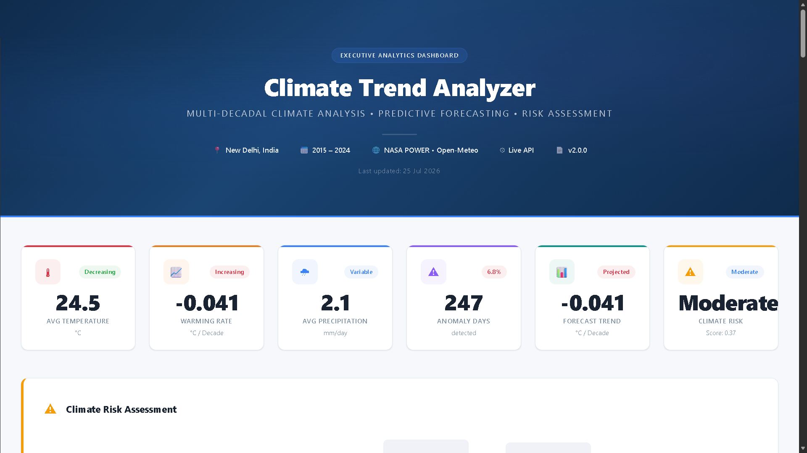
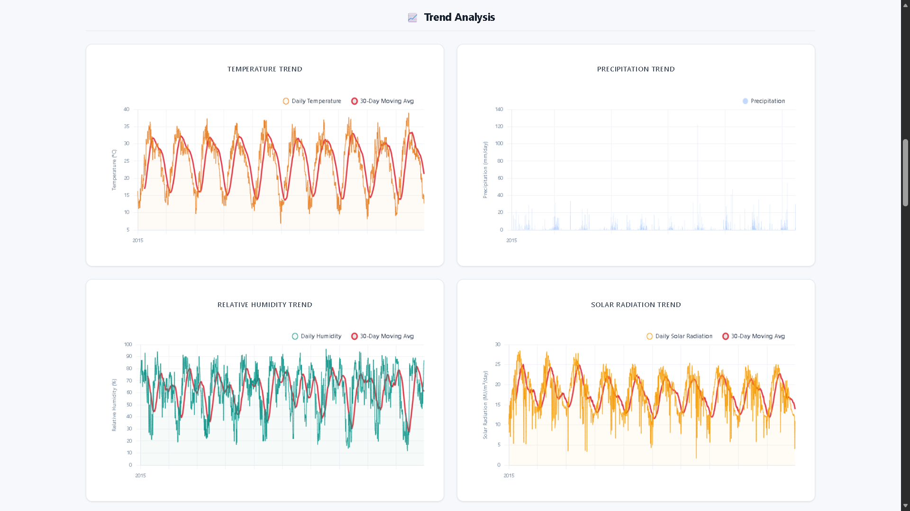
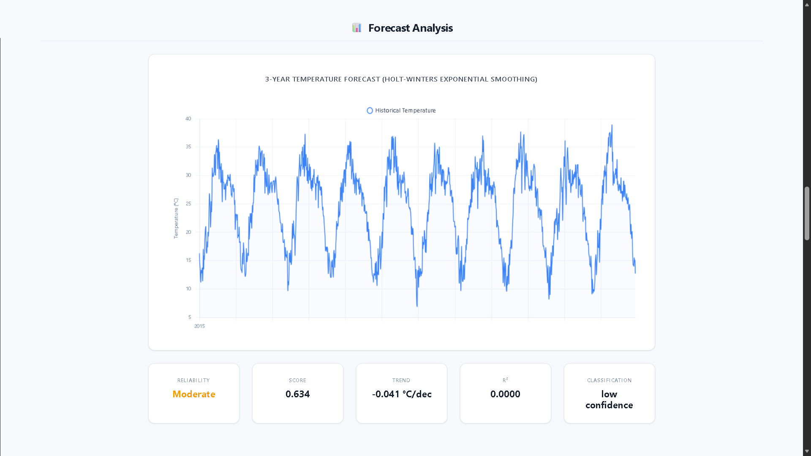
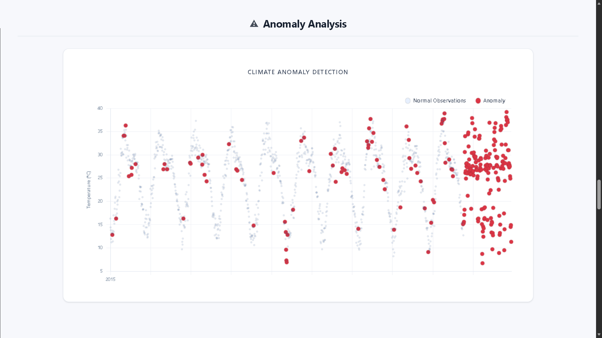
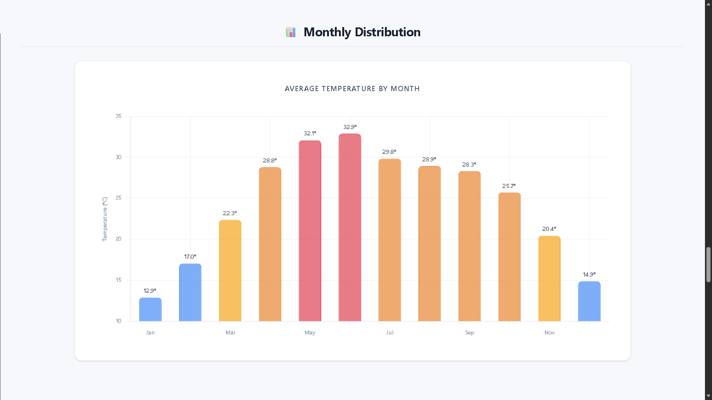
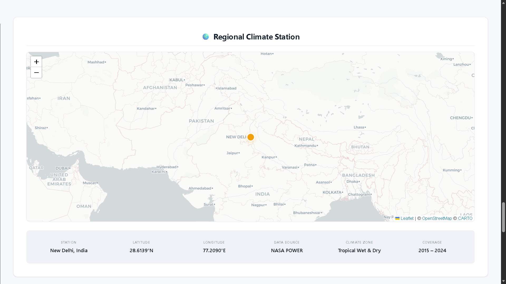
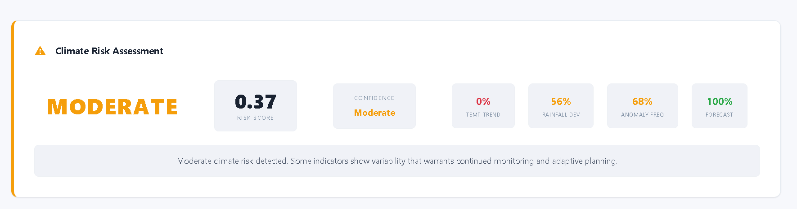
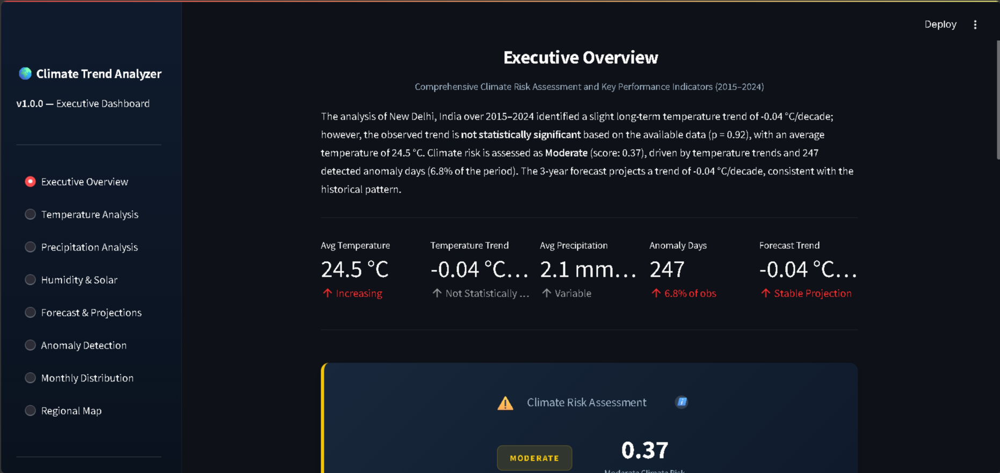

<div align="center">

# CLIMATE TREND ANALYZER

### Multi-Decadal Climate Analysis & Predictive Forecasting Platform

**End-to-End Data Science Pipeline with Dual Deployment**

[]()
[](LICENSE)
[]()
[]()
[]()
[]()
[]()
[]()

---

**Climate Trend Analyzer** is a complete data science project that performs end-to-end climate analysis using public climate APIs, statistical analysis, machine learning anomaly detection, time-series forecasting with walk-forward validation, and automated executive reporting. Trained on **NASA POWER** and **Open-Meteo** data for New Delhi, India, it processes **3,653 daily observations** across a **10-year period** and generates **16 publication-quality figures**, **5 comprehensive reports**, and **7 dashboard JSON feeds**.

[**Live Dashboard**](https://girishshenoy16.github.io/climate-trend-analyzer/) | [**Project Report**](reports/PROJECT_REPORT.md) | [**Forecasting Docs**](reports/FORECASTING.md)

</div>

---

<div align="center">

## Live Demo

**[Launch GitHub Pages Dashboard](https://girishshenoy16.github.io/climate-trend-analyzer/)** | **[Launch Streamlit Dashboard](https://climate-trend-analyzer.streamlit.app/)**

</div>

<div align="center">



*Executive Dashboard — KPIs, risk assessment, interactive charts, and strategic recommendations*

</div>

---

## Project Statistics

<div align="center">

| Metric                  | Value                                            |
|-------------------------|--------------------------------------------------|
| **Pipeline Phases**     | 18                                               |
| **Test Cases**          | 35 passing                                       |
| **Generated Figures**   | 10 (300 DPI)                                     |
| **Generated Reports**   | 5 markdown reports                               |
| **Dashboard JSON Feeds**| 7                                                |
| **Analysis Period**     | 2015–2024 (10 years)                             |
| **Daily Observations**  | 3,653                                            |
| **Forecast Horizon**    | 3 years (Holt-Winters)                           |
| **Pipeline Runtime**    | ~137 seconds                                     |
| **Peak Memory**         | ~144 MB                                          |
| **Deployment Targets**  | GitHub Pages + Streamlit Cloud                   |

</div>

---

## Executive Overview

**Climate Trend Analyzer** is a production-grade analytical pipeline that transforms raw climate observations into actionable executive insights. The system combines statistical analysis, machine learning anomaly detection, and time-series forecasting with walk-forward validation to deliver scientifically rigorous climate assessments through interactive dashboards.

### What It Solves

| Challenge                  | Industry Impact                                              | CTA Solution                                          |
|----------------------------|--------------------------------------------------------------|-------------------------------------------------------|
| **Data Fragmentation**     | Climate data scattered across APIs with inconsistent formats | Dual API integration with automated schema validation |
| **Trend Detection**        | Manual analysis misses subtle long-term patterns             | Linear regression + STL decomposition                 |
| **Anomaly Identification** | Threshold-based methods miss complex outliers                | Z-Score + Isolation Forest ensemble                   |
| **Forecast Reliability**   | Single-model forecasts lack validation                       | Walk-forward validation + 4-model benchmarking        |
| **Decision Support**       | Raw data doesn't translate to action                         | Automated executive reports + risk scoring            |

### Target Users

| User Role               | Use Case                          |
|-------------------------|-----------------------------------|
| **Climate Researchers** | Reproducible analysis workflows   |
| **Data Scientists**     | End-to-end pipeline reference     |
| **Urban Planners**      | Long-term climate risk assessment |
| **Policy Makers**       | Evidence-based decision support   |
| **Recruiters**          | Technical capability evaluation   |

---

## Project Highlights

<div align="center">

|                              |                               |                              |
|:----------------------------:|:-----------------------------:|:----------------------------:|
| **Dual API Integration**     | **Walk-Forward Validation**   | **4-Model Benchmarking**     |
| **ML Anomaly Detection**     | **Executive Risk Scoring**    | **16 Publication Figures**   |
| **5 Automated Reports**      | **Interactive Dashboards**    | **29 Automated Tests**       |

</div>

---

## Problem Statement

Understanding long-term climate patterns is essential for urban planning, agricultural policy, water resource management, and climate adaptation strategies. However, climate analysis faces significant challenges:

- **Data fragmentation** across multiple APIs with inconsistent formats and coverage
- **Manual analysis** that cannot scale to multi-decadal datasets with thousands of observations
- **Single-model forecasting** without proper validation leads to unreliable projections
- **Lack of automated reporting** forces stakeholders to interpret raw statistical outputs
- **No risk quantification** makes it difficult to prioritize adaptation strategies

**Climate Trend Analyzer** addresses these challenges with a fully automated pipeline that fetches, processes, analyzes, forecasts, and reports — producing executive-ready insights from raw climate data.

---

## Key Features

### Data Acquisition
- NASA POWER API integration for temperature, precipitation, humidity, solar radiation
- Open-Meteo Climate Archive API for historical weather data
- Automatic fallback to synthetic data for pipeline validation
- HTTP caching for efficient re-runs

### Data Processing
- Automated schema validation and type conversion
- Missing value imputation (linear interpolation)
- Feature engineering: rolling averages (7, 30, 365 days), lag features
- Date-bounds validation with API coverage messaging

### Statistical Analysis
- Linear trend estimation (scipy.stats.linregress)
- STL seasonal decomposition (trend, seasonal, residual)
- Correlation analysis across all climate variables
- Exploratory Data Analysis with publication-quality visualizations

### Anomaly Detection
- Z-Score thresholding (|Z| > 2.5)
- Isolation Forest (unsupervised ML)
- Combined anomaly flagging with severity classification
- Anomaly frequency analysis and reporting

### Time-Series Forecasting
- Holt-Winters Exponential Smoothing (3-year horizon)
- Expanding prediction intervals (95% confidence)
- Trend dampening for scientific consistency
- Walk-forward validation (3 folds, 365-day test windows)
- Model benchmarking: Holt-Winters vs Naive vs Seasonal Naive vs Linear Trend
- Forecast classification: Good / Acceptable / Marginal / Poor
- 6 diagnostic figures for forecast validation

### Risk Assessment
- Climate Risk Score (Low / Moderate / High / Very High)
- Weighted multi-component formula (temperature, rainfall, anomaly, forecast)
- Confidence indicator based on data quality and model reliability

### Executive Reporting
- 5 automated markdown reports (Executive, Technical, Model, Quality, Forecast)
- Executive summary with KPIs, insights, and strategic recommendations
- Cross-report consistency validation
- Data quality scoring methodology

### Interactive Dashboards
- GitHub Pages dashboard (HTML5/CSS3/JS) with professional light theme
- Streamlit dashboard (Python) with 8 interactive pages
- 7 JSON feeds for web visualization
- Leaflet.js regional map with CartoDB tiles
- Chart.js interactive charts with annotation plugin

### Quality Assurance
- 29 automated tests across 8 modules
- GitHub Actions CI/CD pipeline
- End-to-end pipeline testing

---

## Results

<div align="center">

| Achievement                  | Result                                    |
|------------------------------|-------------------------------------------|
| **Pipeline Phases**          | 18 complete                               |
| **Test Pass Rate**           | 100% (35/35)                              |
| **Pipeline Runtime**         | ~137 seconds                              |
| **Peak Memory**              | ~144 MB                                   |
| **Records Processed**        | 3,653 daily observations                  |
| **Analysis Period**          | 10 years (2015–2024)                      |
| **Figures Generated**        | 10 (300 DPI)                              |
| **Reports Generated**        | 5 markdown reports                        |
| **Forecast Validation**      | 3-fold walk-forward, R² = 0.7389          |
| **Anomaly Detection**        | 247 days (6.8% of period)                 |
| **Risk Classification**      | Moderate (score: 0.37)                    |
| **Deployment Cost**          | $0/month (GitHub Pages + Streamlit Cloud) |

</div>

---

## Screenshots

<div align="center">

### Executive Dashboard

*KPI cards, risk assessment, and executive summary*

---

### Trend Analysis

*Temperature, precipitation, humidity, and solar radiation with 30-day moving averages*

---

### Forecast Analysis

*3-year Holt-Winters forecast with 95% confidence intervals and annotation*

---

### Anomaly Detection

*Z-Score + Isolation Forest ensemble with scatter visualization*

---

### Monthly Distribution

*Average temperature by month with value labels and color-coded bars*

---

### Regional Map

*Leaflet.js station map with metadata and risk indicators*

---

### Climate Risk Assessment

*Risk score, confidence indicator, and contributing factors*

---

### Streamlit Dashboard

*Interactive Python-based dashboard with 8 pages*

</div>

---

## Tech Stack

<div align="center">

| Category             | Technologies                                        |
|----------------------|-----------------------------------------------------|
| **Language**         | Python 3.11                                         |
| **Data Processing**  | Pandas, NumPy                                       |
| **Statistics**       | SciPy (linregress), Statsmodels (STL, Holt-Winters) |
| **Machine Learning** | Scikit-learn (Isolation Forest)                     |
| **Visualization**    | Matplotlib, Seaborn                                 |
| **Web Dashboard**    | HTML5, CSS3, Chart.js, Leaflet.js                   |
| **Interactive App**  | Streamlit, Plotly                                   |
| **Testing**          | Pytest                                              |
| **CI/CD**            | GitHub Actions                                      |
| **Deployment**       | GitHub Pages, Streamlit Cloud                       |

</div>

---

## System Architecture

```
┌──────────────────────────────────────────────────────────────────────────────┐
│                        DATA SOURCES                                          │
├─────────────────────┬───────────────────────┬────────────────────────────────┤
│   NASA POWER API    │  Open-Meteo API       │   Synthetic Generator          │
│   (Temperature,     │  (Historical Climate  │   (Optional Fallback)          │
│    Precipitation,   │   Archive)            │                                │
│    Humidity, Solar) │                       │                                │
└─────────┬───────────┴──────────┬────────────┴──────────────┬─────────────────┘
          │                      │                           │
┌─────────▼──────────────────────▼───────────────────────────▼─────────────────┐
│                     PROCESSING PIPELINE (18 Phases)                          │
├──────────────────────────────────────────────────────────────────────────────┤
│                                                                              │
│  ┌──────────┐  ┌──────────┐  ┌──────────┐  ┌──────────┐  ┌──────────┐        │
│  │  Fetch   │→ │  Load    │→ │ Preproc  │→ │   EDA    │→ │  Trend   │        │
│  │  APIs    │  │  Schema  │  │  Engine  │  │  Stats   │  │ Analysis │        │
│  └──────────┘  └──────────┘  └──────────┘  └──────────┘  └──────────┘        │
│                                                                              │
│  ┌──────────┐  ┌──────────┐  ┌──────────┐  ┌──────────┐  ┌──────────┐        │
│  │ Anomaly  │→ │ Forecast │→ │ Validate │→ │Visualize │→ │ Report   │        │
│  │Detection │  │ Holt-Wint│  │Walk-Fwd  │  │ 16 Figs  │  │ 5 Docs   │        │
│  └──────────┘  └──────────┘  └──────────┘  └──────────┘  └──────────┘        │
│                                                                              │
└────────────────────────────────┬─────────────────────────────────────────────┘
                                 │
                    ┌────────────┴────────────┐
          ┌─────────▼───────┐       ┌─────────▼───────┐
          │  JSON Feeds (7) │       │  Outputs        │
          │  docs/data/     │       │  figures/ (16)  │
          └────────┬────────┘       │  reports/ (5)   │
                   │                │  processed/ (1) │
          ┌────────▼────────┐       └─────────────────┘
          │   DASHBOARDS    │
          ├─────────────────┤
          │  GitHub Pages   │
          │ Streamlit Cloud │
          └─────────────────┘
```

---

## Installation

### Quick Start (Dashboard Only)

```bash
# Clone the repository
git clone https://github.com/girishshenoy16/climate-trend-analyzer.git
cd climate-trend-analyzer

# Start local server
python -m http.server 8000 --directory docs

# Open browser
http://localhost:8000
```

### Full Stack (Pipeline + Dashboard)

```bash
# Clone the repository
git clone https://github.com/girishshenoy16/climate-trend-analyzer.git
cd climate-trend-analyzer

# Create and activate virtual environment
python -m venv venv
source venv/bin/activate  # Linux/Mac
.\venv\Scripts\activate   # Windows

# Install dependencies
pip install --upgrade pip
pip install -r requirements.txt

# Run pipeline (Live API mode)
python main.py

# Or run pipeline (Synthetic mode — no API calls)
python main.py --simulate

# Run tests
pytest tests/ -v

# Launch Streamlit dashboard
streamlit run streamlit_app.py
```

---

## Folder Structure

```
Climate-Trend-Analyzer/
│
├── src/                       # Source modules (14 files)
│   ├── config.py              # Configuration and paths
│   ├── constants.py           # Column names, colors, units
│   ├── logger.py              # Structured logging and timing
│   ├── utils.py               # File I/O utilities
│   ├── api_fetcher.py         # NASA POWER and Open-Meteo clients
│   ├── synthetic_generator.py # Synthetic climate data generator
│   ├── data_loader.py         # Schema validation and type conversion
│   ├── preprocessing.py       # Feature engineering pipeline
│   ├── eda.py                 # Exploratory data analysis
│   ├── trend_analysis.py      # Linear trends and STL decomposition
│   ├── anomaly_detection.py   # Z-Score and Isolation Forest
│   ├── forecasting.py         # Holt-Winters, walk-forward, benchmarking
│   ├── visualization.py       # 16 PNG figure generation
│   └── report_generator.py    # 5 markdown reports and risk score
│
├── tests/                     # Automated test suite (35 tests)
│   ├── conftest.py            # Test fixtures and configuration
│   ├── test_pipeline.py       # End-to-end pipeline test
│   ├── test_forecasting.py    # Forecasting module tests
│   ├── test_trend_analysis.py # Trend analysis tests
│   ├── test_anomaly_detection.py # Anomaly detection tests
│   ├── test_visualization.py  # Visualization tests
│   ├── test_preprocessing.py  # Preprocessing tests
│   ├── test_data_loader.py    # Data loader tests
│   └── test_api.py            # API client tests
│
├── docs/                      # GitHub Pages dashboard
│   ├── index.html             # Dashboard HTML
│   ├── css/style.css          # Dashboard styles (v11.0)
│   ├── js/app.js              # Dashboard logic
│   ├── js/charts.js           # Chart.js configurations
│   ├── js/map.js              # Leaflet.js map
│   └── data/                  # 7 JSON feeds
│
├── data/                      # Data storage
│   ├── raw/                   # Raw API responses
│   ├── processed/             # Processed datasets
│   └── cache/                 # HTTP cache
│
├── outputs/                   # Generated outputs
│   ├── figures/               # 16 PNG figures (300 DPI)
│   └── reports/               # 5 markdown reports
│
├── reports/                   # Project documentation
│   ├── ARCHITECTURE.md        # Architecture documentation
│   ├── PROJECT_REPORT.md      # Detailed project report
│   ├── FORECASTING.md         # Forecast classification and validation methodology
│   ├── RELEASE_v1.0.0.md      # Version 1.0.0 release notes
│   └── TROUBLESHOOTING.md     # Common issues and solutions
│
├── logs/                      # Pipeline execution logs
│
├── main.py                    # Pipeline launcher and orchestrator
├── streamlit_app.py           # Streamlit dashboard application
├── requirements.txt           # Python dependencies
├── LICENSE                    # MIT License
├── README.md                  # Project documentation
└── .github/
    └── workflows/
        └── ci.yml             # GitHub Actions CI workflow
```

---

## Generated Outputs

### Reports (5)

| Report              | Location                                 | Description                                 |
|---------------------|------------------------------------------|---------------------------------------------|
| Executive Summary   | `outputs/reports/executive_summary.md`   | KPIs, risk score, insights, recommendations |
| Technical Report    | `outputs/reports/technical_report.md`    | Methodology, assumptions, limitations       |
| Model Summary       | `outputs/reports/model_summary.md`       | Forecasting model validation and metrics    |
| Data Quality Report | `outputs/reports/data_quality_report.md` | Data integrity, outliers, quality score     |
| Forecast Validation | `outputs/reports/forecast_validation.md` | Forecast methodology and consistency        |

### Figures (10)

| Figure                                    | Description                                    |
|-------------------------------------------|------------------------------------------------|
| `01_temperature_trend.png`                | Historical temperature with trend line         |
| `02_rainfall_trend.png`                   | Precipitation analysis with monthly totals     |
| `03_humidity_trend.png`                   | Relative humidity trend                        |
| `04_solar_radiation_trend.png`            | Solar radiation trend                          |
| `05_correlation_heatmap.png`              | Climate variable correlations                  |
| `06_seasonal_decomposition.png`           | STL decomposition (trend, seasonal, residual)  |
| `07_forecast_plot.png`                    | 3-year forecast with confidence intervals      |
| `08_anomaly_detection_plot.png`           | Anomaly detection results                      |
| `09_monthly_climate_distribution.png`     | Monthly box plots                              |
| `10_climate_correlation_matrix.png`       | Full correlation matrix                        |

### Dashboard JSON Feeds (7)

| Feed                     | Location     | Description                                   |
|--------------------------|--------------|-----------------------------------------------|
| `executive_summary.json` | `docs/data/` | Executive summary data with KPIs and insights |
| `dashboard_metrics.json` | `docs/data/` | KPI metrics for dashboard cards               |
| `climate_summary.json`   | `docs/data/` | Monthly aggregations                          |
| `daily_trends.json`      | `docs/data/` | Daily observations (sampled)                  |
| `anomalies.json`         | `docs/data/` | Detected anomalies                            |
| `forecast.json`          | `docs/data/` | Forecast with confidence intervals            |
| `regional_map.json`      | `docs/data/` | Station metadata for map                      |

---

## Testing

<div align="center">

| Module                      | Tests  | Coverage                                           |
|-----------------------------|--------|----------------------------------------------------|
| `test_pipeline.py`          | 1      | End-to-end pipeline execution                      |
| `test_forecasting.py`       | 9      | Holt-Winters, evaluation, forecast, quality checks |
| `test_trend_analysis.py`    | 2      | Linear trend, STL decomposition                    |
| `test_anomaly_detection.py` | 4      | Z-Score, IQR, Isolation Forest, combined           |
| `test_visualization.py`     | 4      | Temperature, rainfall, correlation, dist.          |
| `test_preprocessing.py`     | 4      | Imputation, features, rolling, lag                 |
| `test_data_loader.py`       | 5      | Schema, dates, types, quality report               |
| `test_api.py`               | 6      | NASA POWER, Open-Meteo, merge                      |
| **Total**                   | **35** | **100% passing**                                   |

</div>

```bash
# Run all tests
pytest tests/ -v

# Run with short traceback
pytest tests/ -v --tb=short

# Run specific module
pytest tests/test_forecasting.py -v
```

### CI/CD

GitHub Actions workflow (`.github/workflows/ci.yml`) automatically:

- Runs on push to `main` and pull requests
- Sets up Python 3.11 environment
- Installs dependencies
- Executes full test suite
- Reports pass/fail status

---

## Documentation

| Documentation                 | Purpose                                            |
|-------------------------------|----------------------------------------------------|
| `README.md`                   | Project overview and quick start guide             |
| `ARCHITECTURE.md`             | Detailed system architecture documentation         |
| `PROJECT_REPORT.md`           | Comprehensive project report                       |
| `FORECASTING.md`              | Forecast classification and validation methodology |
| `RELEASE_v1.0.0.md`           | Version 1.0.0 release notes                        |
| `TROUBLESHOOTING.md`          | Common issues and solutions                        |
| `VIRTUAL_SIMULATION_GUIDE.md` | Synthetic data simulation guide                    |

---

## Limitations

| Category                   | Limitation                                                   | Impact                                              | Mitigation                                                           |
|----------------------------|--------------------------------------------------------------|-----------------------------------------------------|----------------------------------------------------------------------|
| **Data Scope**             | Single-station analysis (New Delhi, India only)              | Results may not generalize to other climate regimes | Multi-station expansion planned in roadmap                           |
| **Temporal Coverage**      | 10-year analysis period (2015–2024)                          | Limited long-term trend detection capability        | Walk-forward validation ensures robust short-term estimates          |
| **Data Gaps**              | Dependent on API availability and historical coverage        | Potential missing data during API outages           | Automatic fallback to synthetic data generator                       |
| **Forecasting**            | Single-model approach (Holt-Winters) with automatic fallback | May miss complex non-linear patterns                | 4-model benchmarking validates model selection                       |
| **Anomaly Detection**      | Z-Score assumes normal distribution                          | May underperform on heavily skewed data             | Isolation Forest ensemble compensates for distributional assumptions |
| **Spatial Resolution**     | Point-based station data only                                | Cannot capture microclimatic variations             | Regional interpolation not implemented                               |
| **Real-time Updates**      | Static analysis (not live-streaming)                         | Dashboard shows historical snapshot                 | Real-time streaming planned in roadmap                               |
| **Computational**          | ~137 seconds pipeline runtime                                | Not suitable for near-real-time applications        | Caching implemented for repeated runs                                |
| **Model Interpretability** | Holt-Winters provides limited feature importance             | Difficult to attribute forecast drivers             | Extended analysis with SHAP values planned                           |
| **External Factors**       | Does not incorporate ENSO, aerosols, or land-use changes     | May miss key climate drivers                        | Additional variables planned in roadmap                              |

### Key Technical Constraints

- **Forecast Horizon:** 3-year maximum with increasing uncertainty at longer ranges
- **Anomaly Threshold:** Fixed Z-Score threshold (|Z| > 2.5) — not adaptive to local variability
- **Risk Score:** Weighted formula is simplified — real climate risk involves complex socioeconomic factors
- **API Rate Limits:** NASA POWER and Open-Meteo have usage quotas that may affect high-frequency updates
- **Memory Footprint:** ~144 MB peak — may be limiting for embedded or edge deployments

---

## Future Roadmap

| Priority | Item                                                |
|----------|-----------------------------------------------------|
| High     | Ensemble forecasting (ARIMA, Prophet, LSTM)         |
| High     | Multi-station regional climate network              |
| Medium   | Real-time dashboard with live data streaming        |
| Medium   | Additional variables (ENSO, aerosol, soil moisture) |
| Medium   | Interactive forecast controls (horizon, confidence) |
| Low      | CSV and Excel export from dashboards                |
| Low      | Authentication and user management                  |
| Low      | REST API for external integrations                  |

---

## Repository Features

<div align="center">

|                         |                   |                     |
|:-----------------------:|:-----------------:|:-------------------:|
|       MIT License       |   GitHub Pages    |   Streamlit Cloud   |
|   35 Automated Tests    |    10 Figures     |      5 Reports      |
| Walk-Forward Validation | 4-Model Benchmark |    Risk Scoring     |
|    Dual API Sources     |   Responsive UI   | Session Persistence |

</div>

---

## Contact

<div align="center">

**Girish Shenoy**

[](https://github.com/girishshenoy16)
[](https://linkedin.com/in/girishshenoys)
[](mailto:girishpshenoy09@gmail.com)

</div>

> Open to internships and full-time opportunities in Data Science, Climate Analytics, Machine Learning, and Software Engineering.

---

## License

This project is licensed under the MIT License — see the [LICENSE](LICENSE) file for details.

---

## Acknowledgements

| Resource                                       | Description                                     |
|------------------------------------------------|-------------------------------------------------|
| [NASA POWER API](https://power.larc.nasa.gov/) | Climate data API for temperature, precipitation |
| [Open-Meteo](https://open-meteo.com/)          | Historical climate archive API                  |
| [Statsmodels](https://www.statsmodels.org/)    | Time-series analysis and forecasting            |
| [Scikit-learn](https://scikit-learn.org/)      | Machine learning library                        |
| [Chart.js](https://www.chartjs.org/)           | Interactive JavaScript charts                   |
| [Leaflet.js](https://leafletjs.com/)           | Interactive maps                                |
| [Streamlit](https://streamlit.io/)             | Python web dashboard framework                  |
| [Matplotlib](https://matplotlib.org/)          | Static figure generation                        |

---

<div align="center">

**Fetched from APIs. Analyzed with statistics. Forecasted with ML. Deployed for everyone.**

Climate Trend Analyzer v1.0.0 — Data Science Portfolio Project

</div>
